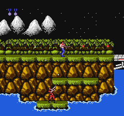
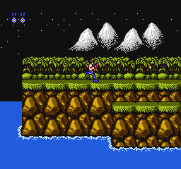
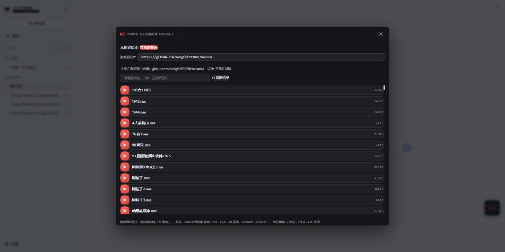

# dsh-plugin-fc-emulator

等 Agent 出结果的时候，来一把小霸王。

DeepSeek Harness Web 右下角挂一颗 FC 悬浮球，点开全屏游戏厅，跑红白机 / NES。核心是 [fceumm](https://github.com/libretro/libretro-fceumm)（WebAssembly，589 种芯片）。

**本仓库不含任何 ROM**——请自行准备你合法拥有的卡带镜像。

<p align="center">
  
  
</p>

<p align="center">
  
</p>

## 安装

前提：已能运行 `dsh web`。

```bash
dsh plugin --profile web add github:sknagato/dsh-plugin-fc-emulator
```

装完后**重启**一次 DSH web，右下角出现悬浮球即成功。

卸载：`dsh plugin --profile web remove dsh-plugin-fc-emulator` 并重启。

## 功能

- **悬浮球游戏厅**：本地上传 `.nes`，或从在线库按需下载
- **在线游戏库**：自己填 GitHub 地址；支持根仓库（如 `owner/repo`）或带子目录（如 `…/tree/master/roms`）。可先在 GitHub 搜索 `nes游戏合集` 找源，填入后回车 /「刷新清单」。地址存 `localStorage`，下次自动回填
- **存档**：整局快照 + 游戏内电池存档；退出自动存，下次可继续
- **操控**：`WASD` / 方向键移动 · `K`/`J` = A/B · `I`/`U` 连击 · `1`/`5` = START/SELECT · `` ` `` 快速隐藏 · `[`/`]` 快速存读档 · 可改键、触屏虚拟手柄
- **其它**：暂停 / 重置 / 截图 / 静音 / FPS

## 免责声明

本插件只提供模拟器，**不附带、不托管任何游戏 ROM**。请仅使用你合法拥有的卡带镜像；在线库只是按你填写的仓库做索引与下载，版权归原权利人与仓库维护者，使用责任自负。

## 许可

- 插件代码：MIT
- fceumm 核心：GPL-2.0（见 [THIRD_PARTY.md](THIRD_PARTY.md) 与 `core-fce/` 对应源码）
